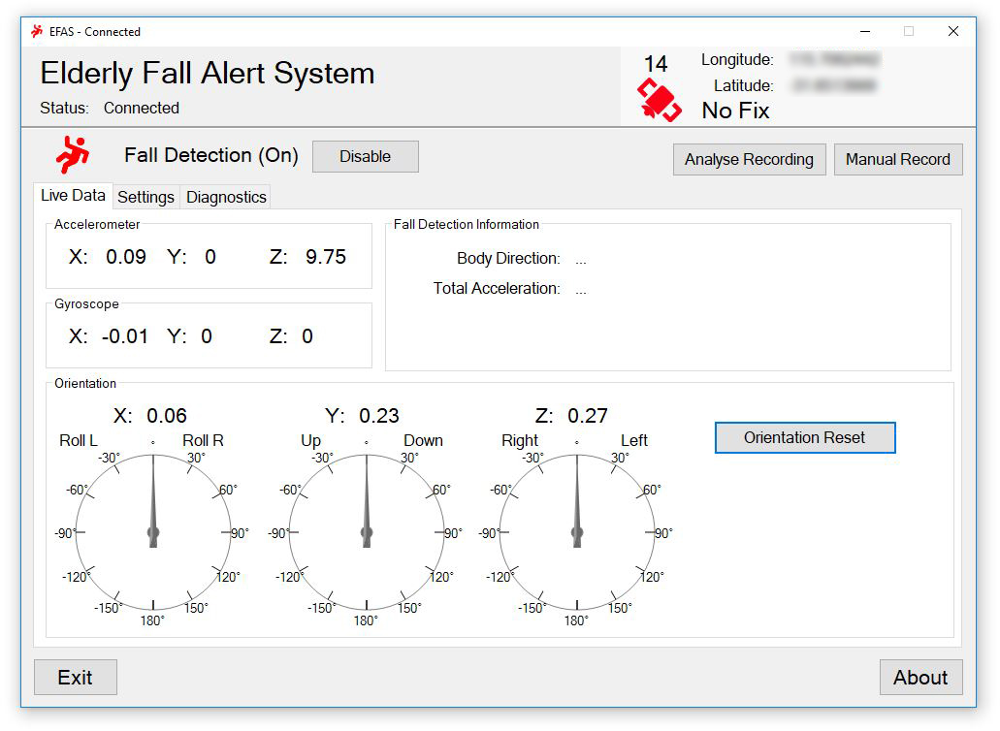
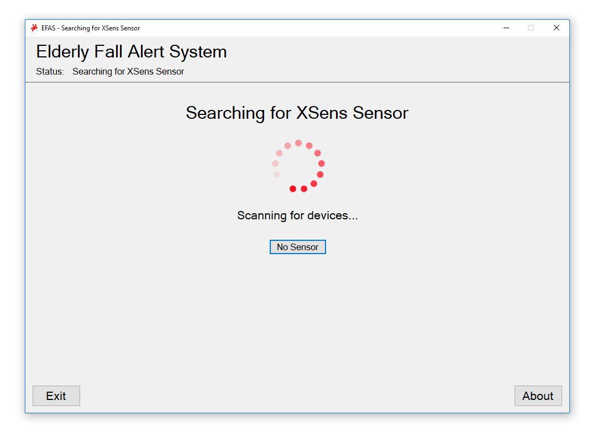
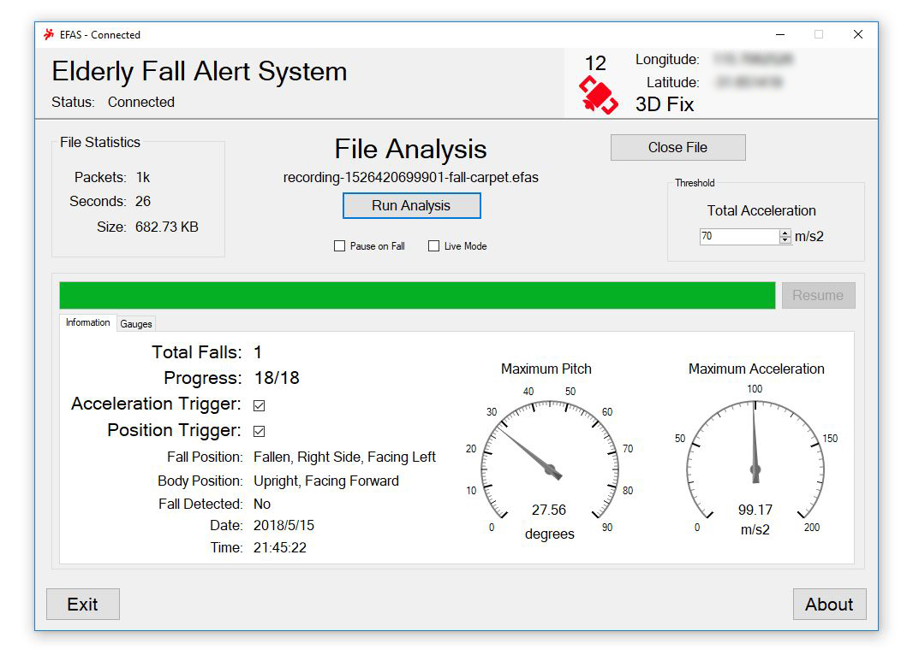
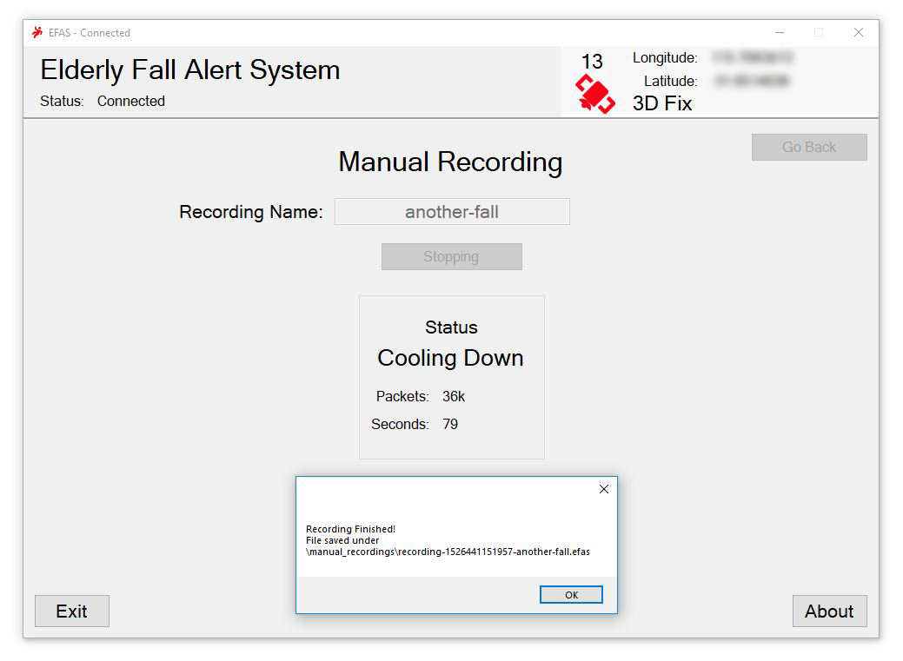

# E.F.A.S (Elderly Fall Alert System) 
- Uses the Xsens MTI-G-710.
- Is able to detect a fall, and send an alert.
- Built for University Project.
- Written in C#, using the XSens API.

## Purpose
There are a large variety of Fall Alert Systems out there, however the majority of them involve a **manual button**. 
The purpose of EFAS, and what sets it apart from other fall alert systems, is the ability to accurately detect falls **without human interaction**.
Its ultimate purpose is to save lives by reporting falls where the person has been knocked **unconscious** from the fall.

It is not designed to detect **small stumbles**, or anything that can easily be reported using a **button**.

It strives at: 
- Detecting Falls where the person has been knocked **unconscious**
- Being **Accurate**, and having an easily adjustable **sensitivity**. 

## Features
EFAS can:
 - **Detect** Live Falls.
 - **Record** & Analyse Recorded Falls.
 - **Alert** via a variety of methods.

 There is an 8 page document covering everything this program does in depth, including:

 EFAS Documentation v1.0.0.0 [Download](https://github.com/PoxyDoxy/EFAS/releases/latest/)

## Requirements 
The ‘EFAS.exe’ requires certain files in order to start up. These are:
•	AGauge.dll
•	xsensdeviceapi_csharp64.dll
•	xsensdeviceapi64.dll
•	xstypes64.dll

In addition, it requires ‘trigger_sound.wav’ in order to play sound alerts.
These files should be located next to ‘EFAS.exe’.

It was made using C# .NET 4.5.1